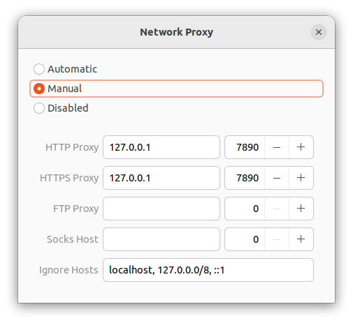

# Clash setup and proxy selection

This is a guidance for Clash setup and manual configuration to fix proxy selection for given domain. 

You may check shell script version at [1](https://cndaqiang.github.io/2020/07/17/clash/), [2](https://github.com/Elegycloud/clash-for-linux-backup/blob/main/scripts/clash_proxy-selector.sh). However, there might be unexpected errors due to differences in config file.


- [Step 0: set up Clash (Linux)](#setup)
  - [Optional: add clash to system service](#sys)

*--Start [here](#group) if your clash is already set up properly.*

- [Step 1: configure new proxy group](#group)
- [Step 2: add rules for proxy selection](#rule)
- [Step 3: check proxy connection](#check)


### Step 0: set up Clash (Linux)<a name="setup"></a>

- Install clash to system

```bash
sudo cp magic /usr/local/bin/clash
```

- Add `config.yaml` (find this from your service provider)

- Configure manual proxy at `Settings -> Network -> Network Proxy`. Default port at 7890.

  

- Check availability by running `clash`


#### Optional: add clash to system service<a name="sys"></a>

```bash
sudo gedit /etc/systemd/system/clash.service
```

Replace [path-to-config.yaml] with your own path

 ```
 Description=Clash - A rule-based tunnel in Go
 
 Documentation=https://github.com/Dreamacro/clash/wiki
 
 [Service]
 
 OOMScoreAdjust=-1000
 
 ExecStart=/usr/local/bin/clash -f [path-to-config.yaml]
 
 Restart=on-failure
 
 RestartSec=5
 
 [Install]
 
 WantedBy=multi-user.target
 ```


Run:

```bash
sudo systemctl enable clash
sudo systemctl start clash
sudo systemctl status clash
```


### Step 1: configure new proxy group<a name="group"></a>

Check the US `proxies` in your config. Proxy config looks like: 

```yaml
  -
    name: 'HK PRO 11'
    type: xxxx
    server: xxxx
    port: xxxx
    cipher: xxxx
    password: xxxx
    protocol: xxxx
    protocolparam: xxxx
    protocol-param: xxxx
    obfs: xxxx
    obfsparam: xxxx
    obfs-param: xxxx

```


Copy the names into a list and add them to this proxy group: 

```yaml
  -
    name: ChatGPT
    type: select
    proxies:
      - 'U*S* PRO' # Replace this with your own proxy name
      - '美*国* IE*PL' # Replace this with your own proxy name
```


Add this new proxy group to `proxy-groups`

This is a only a ***<u>sample</u>*** !!! Change the list of proxies into your own ones


### Step 2: add rules for proxy selection<a name="rule"></a>

Add the following lines into `rules`:

```yaml
  - DOMAIN-SUFFIX,openai.com,ChatGPT
  - DOMAIN-SUFFIX,chatgpt.com,ChatGPT
  - DOMAIN-SUFFIX,gravatar.com,ChatGPT
  - DOMAIN-SUFFIX,oaistatic.com,ChatGPT
  - DOMAIN-SUFFIX,scholar.google.com,ChatGPT
  
  # For proxy testing
  - DOMAIN-SUFFIX,whatismyipaddress.com,ChatGPT
```


### Step 3: check proxy connection<a name="check"></a>

Go to `whatismyipaddress.com` to check if you are properly landed